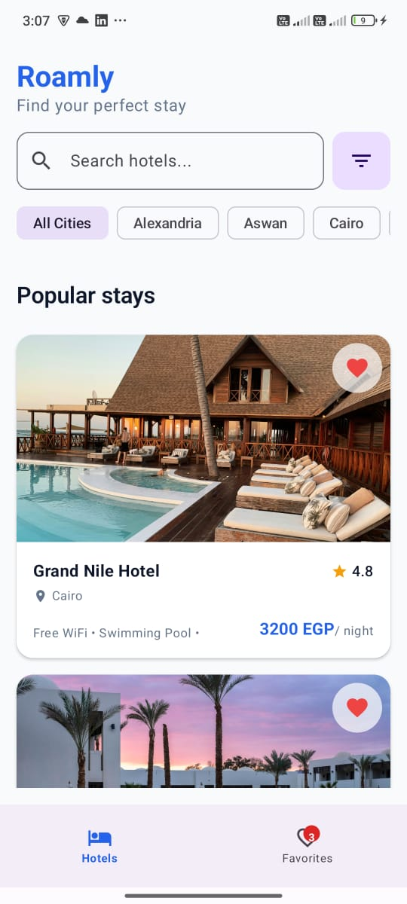
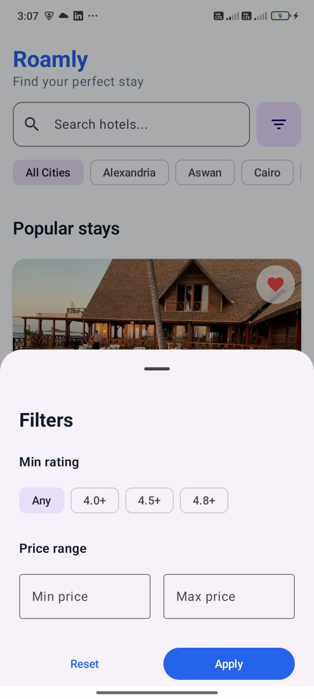
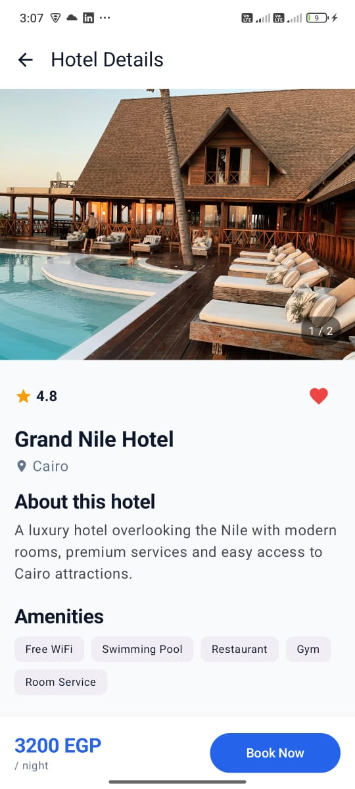
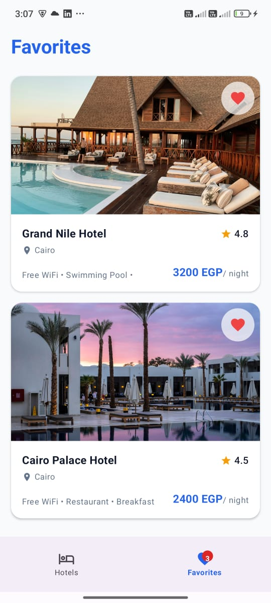
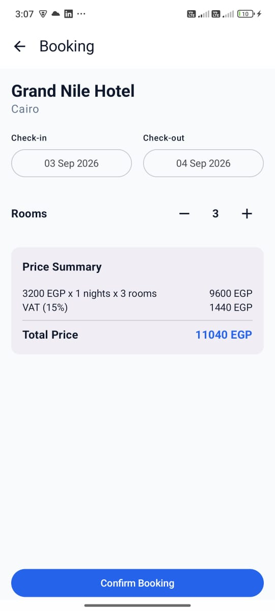
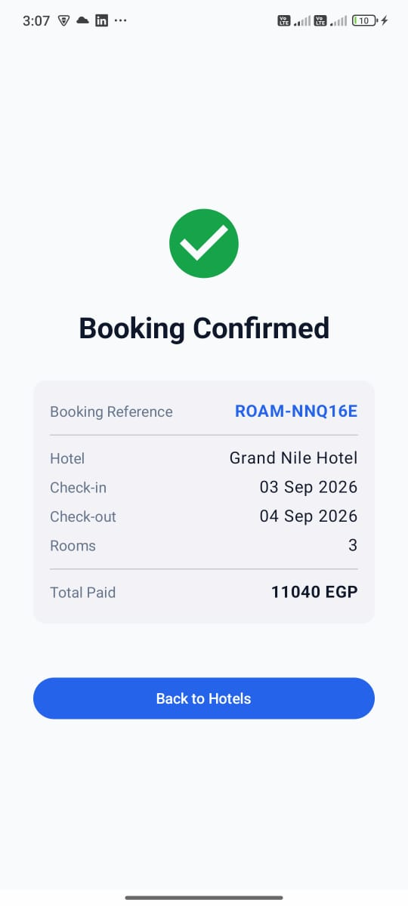

# Roamly — Hotel Explorer

Roamly is a production-minded native Android hotel exploration and booking application built with Kotlin and Jetpack Compose.

The application demonstrates clean architecture, reactive state management, local persistence, offline capability, testability, and a complete hotel booking flow.

---

## 📱 App Screenshots

### 1. Hotels — Home

Browse available hotels with their images, names, cities, ratings, and prices. The home screen also supports hotel search, favorites, and navigation to hotel details.



---

### 2. Hotel Filters

Filter hotels by city, minimum rating, and price range to quickly find suitable hotels.



---

### 3. Hotel Details

View complete hotel information including images, rating, price, description, amenities, location, and favorite status.



---

### 4. Favorites

View saved hotels in one place. Favorite state is persisted locally using Room and synchronized across the application.



---

### 5. Booking

Select check-in and check-out dates and the number of rooms. The screen validates dates and displays the booking price breakdown.



---

### 6. Booking Success

After confirming the booking, the application displays the calculated total and generates a local booking reference.



---

## ✨ Features

### Hotel Listing

* Browse hotels with:

    * Hotel image
    * Name
    * City
    * Rating
    * Price per night
* Debounced hotel-name search.
* Filter by city, minimum rating, and price range.
* Incremental pagination.
* Prevents duplicate pagination requests and duplicate hotel results.
* Loading, empty, error, retry, and cached-data states.

### Hotel Details

* Hotel image gallery.
* Hotel name, city, rating, and price.
* Description and address.
* Amenities.
* Location coordinates.
* Add/remove favorites.
* Offline access through locally cached hotel data.
* Navigate directly to booking.

### Favorites

* Add/remove hotels from the home screen.
* Add/remove hotels from the details screen.
* Persistent Room storage.
* Favorite state synchronized across screens.
* Favorites survive app restart and offline usage.
* Reactive favorites count badge.
* Favorites are scoped to the current user.

### Booking

* Select check-in and check-out dates.
* Select number of rooms.
* Check-in cannot be in the past.
* Check-out must be after check-in.
* Automatic calculation of:

    * Number of nights
    * Base price
    * VAT (15%)
    * Total price
* Generates a local booking reference.
* Booking success screen.

---

## 🏗️ Architecture

Roamly follows **Clean Architecture with MVVM**.

```text
Presentation
     ↓
  Domain
     ↓
   Data
```

### Presentation

Contains:

* Jetpack Compose UI
* ViewModels
* UI state
* User interactions

### Domain

Contains:

* Business models
* Use cases
* Repository contracts
* Booking calculation and validation logic

The domain layer is independent from Android framework, Compose, Room, and data implementation details.

### Data

Contains:

* Local JSON data source
* Room database
* DAOs
* Entities
* DTOs
* Repository implementations
* Data mapping

---

## 📦 Project Structure

```text
Roamly/
├── app/
│   ├── navigation/
│   └── MainActivity
│
├── core/
│   ├── common/
│   ├── data/
│   ├── designsystem/
│   └── domain/
│
└── features/
    ├── hotels/
    ├── hotel-details/
    ├── favorites/
    └── booking/
```

### Module Dependency Direction

```text
app
 ↓
features
 ↓
domain

data
 ↓
domain
```

Features do not directly depend on the Data implementation.

---

## 🧠 Why MVVM?

MVVM was selected because the application is highly state-driven and Jetpack Compose works naturally with observable state exposed from ViewModels.

ViewModels own screen state and user actions, while Composables remain focused on rendering UI and forwarding events.

This separation improves testability, maintainability, and state handling across configuration changes and process recreation.

---

## 💾 Data Source & Offline Strategy

For this take-home task, hotel data is provided through a **local JSON mock data source**.

The task allows an API, mock data, or local JSON. The local dataset provides deterministic behavior while allowing the application to demonstrate repository abstraction, pagination, caching, loading states, failure handling, and offline behavior.

In a production environment, the data source can be replaced or extended with a remote API without changing the domain layer.

### Room Cache

Room is used as the local persistence layer.

Hotel data is cached locally and can be displayed when the source data cannot be loaded.

Favorites are persisted directly in Room.

### Cache Flow

```text
Load hotel data
      ↓
Local JSON source
      ↓
   Success
      ↓
Update Room cache
      ↓
Display hotels

If source fails
      ↓
Check Room cache
      ↓
Cache available → Display cached data
      ↓
No cache → Display error + Retry
```

A cached-data indicator is displayed when hotel information is being served from the local cache.

Refreshing the hotel list updates the local Room cache with the latest available dataset.

---

## 📄 Pagination

The hotel list uses incremental pagination over the available dataset.

The application requests the next page when the user approaches the end of the currently displayed list.

Pagination state prevents:

* Duplicate page requests.
* Duplicate hotel results.
* Re-triggering the same page while it is already being requested.

Search and filter changes reset the pagination state.

---

## 🔄 State Management

The application uses **Kotlin Coroutines and Flow**.

The general data flow is:

```text
User Action
     ↓
ViewModel
     ↓
Use Case
     ↓
Repository
     ↓
Data Source / Room
     ↓
Flow
     ↓
ViewModel State
     ↓
Compose UI
```

Compose collects state using lifecycle-aware collection.

---

## 💉 Dependency Injection

**Hilt** is used for dependency injection.

It provides dependencies such as:

* Repository implementations
* Room database and DAOs
* Data sources
* Use cases
* ViewModels

This keeps dependency creation centralized and improves testability.

---

## 🧭 Navigation

Navigation is implemented using **Navigation 3**.

The main application flow is:

```text
Hotels
  │
  ├── Filters
  │
  ├── Hotel Details
  │      │
  │      └── Booking
  │             │
  │             └── Booking Success
  │
  └── Favorites
```

---

## 🧪 Testing

The project includes tests covering the main business and application behavior.

### Domain Tests

* Booking date validation.
* Number of nights calculation.
* Room-based pricing.
* VAT calculation.
* Total booking price.

### ViewModel Tests

* Hotel listing state.
* Search and filtering behavior.
* Hotel details state.
* Favorite interactions.
* Booking state and confirmation flow.

### Repository Tests

* Successful data loading.
* Data source failure.
* Cache fallback.
* Empty cache + source failure.
* Refresh behavior.
* Room persistence.

### UI Testing

A critical user journey is covered:

```text
Hotels
   ↓
Hotel Details
   ↓
Book Now
   ↓
Booking
```

The UI test verifies navigation and important data passing between screens.

---

## 🛠️ Tech Stack

* **Kotlin**
* **Jetpack Compose**
* **Android SDK**
* **Coroutines**
* **Flow**
* **MVVM**
* **Clean Architecture**
* **Hilt**
* **Room**
* **Navigation 3**
* **Moshi**
* **JUnit**
* **Compose UI Testing**
* **Gradle**

---

## 📱 Requirements

* Android Studio
* JDK compatible with the configured Android Gradle Plugin
* Android SDK
* Minimum Android SDK: **26**

---

## 🚀 Getting Started

1. Clone the repository.
2. Open the project in Android Studio.
3. Sync Gradle.
4. Run the `app` configuration on an Android emulator or physical device.

The hotel dataset is bundled with the application as local JSON, so no external backend is required to run the core experience.

---

## 📦 Build

Build the debug APK:

```bash
./gradlew assembleDebug
```

Run unit tests:

```bash
./gradlew test
```

Run instrumented tests:

```bash
./gradlew connectedDebugAndroidTest
```

---

## ⚖️ Engineering Decisions & Trade-offs

### Local JSON instead of a Remote API

The task explicitly allows local JSON/mock data.

Using a local dataset keeps the submission deterministic and avoids dependency on an external backend while still demonstrating repository abstraction, persistence, caching, pagination, loading states, and failure handling.

The repository and domain layers are separated so that a remote API can be introduced later without changing the domain layer.

### MVVM instead of MVI

MVVM provides sufficient structure for the current scope without introducing additional reducer/event abstractions.

The ViewModel owns screen state and actions while the UI remains stateless and event-driven.

### Local Booking

Booking is intentionally simulated locally because the task requires a booking flow and a local booking reference rather than a real booking backend.

---

## ⚠️ Known Limitations

* Hotel data is provided through a bundled local JSON dataset rather than a live backend.
* Booking confirmation is simulated locally.
* No authentication/backend booking service is included because these are outside the task requirements.
* Hotel availability is not connected to a real inventory system.

---

## 🤖 AI Usage

AI-assisted development was used as a development support tool for brainstorming, debugging assistance, test coverage suggestions, code review, and documentation refinement.

All AI-generated suggestions were reviewed, adapted, and integrated manually. Final architectural and implementation decisions were made based on the project requirements and engineering constraints.

---

## 📌 Future Improvements

If the application were extended into a production system, potential improvements would include:

* Remote hotel API integration using Retrofit or Ktor.
* Server-side pagination and filtering.
* Authentication and user accounts.
* Real booking backend.
* Real-time hotel availability.
* Maps integration.
* Analytics and monitoring.
* Expanded accessibility testing.
* CI/CD automation.

---

## 👩‍💻 Project

**Roamly — Hotel Explorer**

A native Android take-home project focused on production-minded architecture, reliable state management, offline persistence, testability, and a complete hotel exploration and booking experience.
